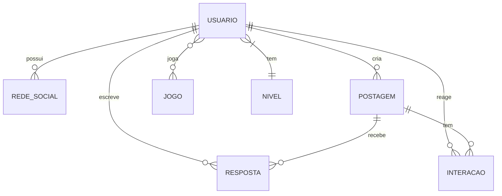

# API Dashboard FURIA

API REST em Spring Boot para gerenciamento de usuários, jogos, níveis, postagens, respostas, interações, eventos e redes sociais.

## Visão geral

- **Stack principal:** Java 17+, Spring Boot 3.4, Spring Web, Spring Data JPA, Spring Security + JWT, Springdoc OpenAPI.  
- **Banco de dados:** MySQL (perfil `dev`) e PostgreSQL (perfil `prod`).  
- **Autenticação:** JWT stateless com login em `/usuarios/logar`.  
- **Documentação automática:** Swagger UI em `/swagger-ui.html`.

## Como executar

### Pré-requisitos

- Java 17+
- Maven 3.9+
- Banco de dados conforme perfil ativo

### Perfis de ambiente

O projeto está com o perfil `prod` ativo por padrão:

```properties
spring.profiles.active=prod
```

- `dev` usa **MySQL** local (`application-dev.properties`)
- `prod` usa **PostgreSQL** via variáveis de ambiente (`application-prod.properties`)

Para rodar localmente com MySQL:

```bash
mvn spring-boot:run -Dspring-boot.run.profiles=dev
```

## Endpoints principais

Base path: `/`

### Usuários

- `GET /usuarios/all`
- `GET /usuarios/{id}`
- `POST /usuarios/logar` *(público)*
- `POST /usuarios/cadastrar` *(público)*
- `PUT /usuarios/atualizar`

### Jogos

- `GET /jogos/all` *(público)*
- `GET /jogos/{id}`
- `POST /jogos/cadastrar`
- `PUT /jogos/atualizar/{id}`
- `DELETE /jogos/{id}`

### Demais recursos

Todos seguem o padrão CRUD com sufixos equivalentes (`/all`, `/{id}`, `/cadastrar`, `/atualizar/{id}`, `DELETE /{id}`):

- `/postagens`
- `/respostas`
- `/interacoes`
- `/eventos`
- `/redes-sociais`
- `/niveis`

> Com exceção dos endpoints públicos listados acima, os demais exigem header `Authorization: Bearer <token>`.

## Documentação detalhada

A análise técnica completa do repositório está em:

- [`docs/ANALISE_REPOSITORIO.md`](docs/ANALISE_REPOSITORIO.md)
- [`docs/ARQUITETURA_HEXAGONAL.md`](docs/ARQUITETURA_HEXAGONAL.md) *(proposta de estrutura de pastas com DTOs e portas/adaptadores)*

## Diagrama entidade-relacionamento


