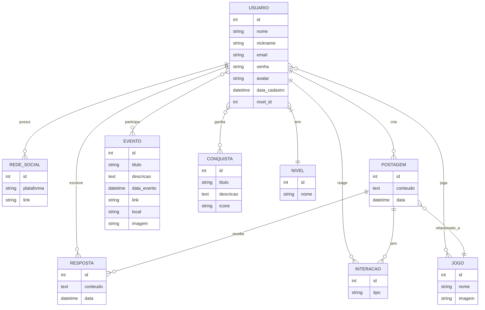

## Diagrama Entidade Relacionamento 



## Estruturas das Pastas

```
api-dashboard-furia/
├─ .mvn/
│  └─ wrapper/
│     └─ maven-wrapper.properties
├─ src/
│  ├─ main/
│  │  ├─ java/
│  │  │  └─ com/
│  │  │     └─ conectados/
│  │  │        └─ conectados/
│  │  │           ├─ configuration/
│  │  │           │  └─ SwaggerConfig.java
│  │  │           ├─ controller/
│  │  │           │  ├─ EventoController.java
│  │  │           │  ├─ InteracaoController.java
│  │  │           │  ├─ JogoController.java
│  │  │           │  ├─ NivelController.java
│  │  │           │  ├─ PostagemController.java
│  │  │           │  ├─ RedeSocialController.java
│  │  │           │  ├─ RespostaController.java
│  │  │           │  └─ UsuarioController.java
│  │  │           ├─ domain/
│  │  │           │  ├─ model/
│  │  │           │  │  ├─ Evento.java
│  │  │           │  │  ├─ Interacao.java
│  │  │           │  │  ├─ Jogo.java
│  │  │           │  │  ├─ Nivel.java
│  │  │           │  │  ├─ Postagem.java
│  │  │           │  │  ├─ RedeSocial.java
│  │  │           │  │  ├─ Resposta.java
│  │  │           │  │  ├─ Usuario.java
│  │  │           │  │  └─ UsuarioLogin.java
│  │  │           │  └─ repository/
│  │  │           │     ├─ EventoRepository.java
│  │  │           │     ├─ InteracaoRepository.java
│  │  │           │     ├─ JogoRepository.java
│  │  │           │     ├─ NivelRepository.java
│  │  │           │     ├─ PostagemRepository.java
│  │  │           │     ├─ RedeSocialRepository.java
│  │  │           │     ├─ RespostaRepository.java
│  │  │           │     └─ UsuarioRepository.java
│  │  │           ├─ security/
│  │  │           │  ├─ BasicSecurityConfig.java
│  │  │           │  ├─ JwtAuthFilter.java
│  │  │           │  ├─ JwtService.java
│  │  │           │  ├─ UserDetailsImpl.java
│  │  │           │  └─ UserDetailsServiceImpl.java
│  │  │           ├─ services/
│  │  │           │  ├─ EventoService.java
│  │  │           │  ├─ InteracaoService.java
│  │  │           │  ├─ JogoService.java
│  │  │           │  ├─ NivelService.java
│  │  │           │  ├─ PostagemService.java
│  │  │           │  ├─ RedeSocialService.java
│  │  │           │  ├─ RespostaService.java
│  │  │           │  └─ UsuarioService.java
│  │  │           └─ ConectadosApplication.java
│  │  └─ resources/
│  │     └─ application.properties
│  └─ test/
│     └─ java/
│        └─ com/
│           └─ conectados/
│              └─ conectados/
│                 ├─ usuariotest/
│                 │  └─ UsuarioTest.java
│                 └─ ConectadosApplicationTests.java
├─ .gitattributes
├─ .gitignore
├─ mvnw
├─ mvnw.cmd
├─ pom.xml
└─ README.md

```