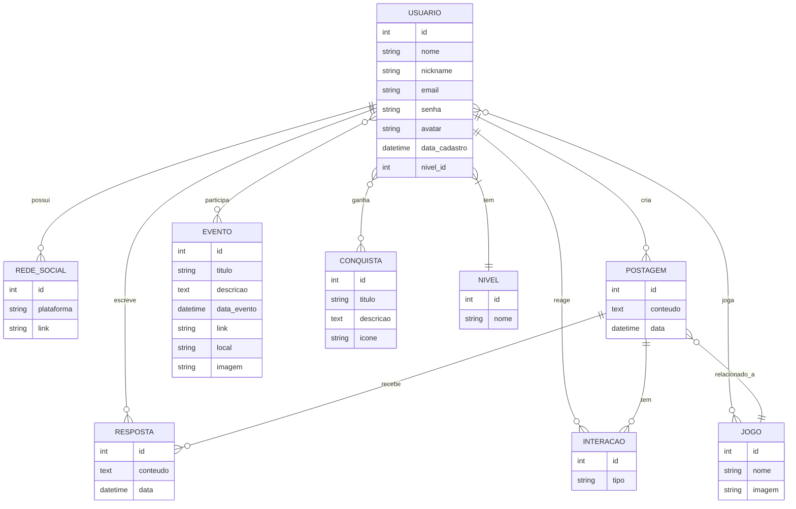

## Diagrama Entidade Relacionamento 


```mermaid
erDiagram
  USUARIO ||--o{ REDE_SOCIAL : possui
  USUARIO ||--o{ POSTAGEM : cria
  USUARIO ||--o{ RESPOSTA : escreve
  USUARIO ||--o{ INTERACAO : reage
  USUARIO }o--o{ JOGO : joga
  USUARIO }o--o{ EVENTO : participa
  USUARIO }o--o{ CONQUISTA : ganha
  USUARIO }|--|| NIVEL : tem

  POSTAGEM ||--o{ RESPOSTA : recebe
  POSTAGEM ||--o{ INTERACAO : tem
  POSTAGEM }o--|| JOGO : relacionado_a

  REDE_SOCIAL {
    int id
    string plataforma
    string link
  }

  USUARIO {
    int id
    string nome
    string nickname
    string email
    string senha
    string avatar
    datetime data_cadastro
    int nivel_id
  }

  POSTAGEM {
    int id
    text conteudo
    datetime data
  }

  RESPOSTA {
    int id
    text conteudo
    datetime data
  }

  INTERACAO {
    int id
    string tipo
  }

  JOGO {
    int id
    string nome
    string imagem
  }

  EVENTO {
    int id
    string titulo
    text descricao
    datetime data_evento
    string link
    string local
    string imagem
  }

  NIVEL {
    int id
    string nome
  }

  CONQUISTA {
    int id
    string titulo
    text descricao
    string icone
  }

```

## Estruturas das Pastas

```
```